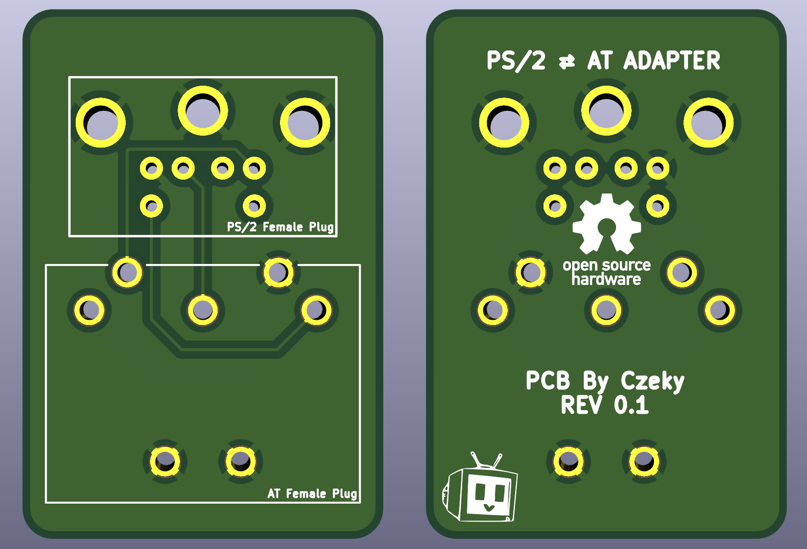

# AT ⇄ PS/2 ADAPTER

A keyboard connection adapter, converts between AT and PS/2 connections in both directions, allowing you to connect an AT keyboard to a PS/2 port or a PS/2 keyboard to an AT port on your PC.

The zipped Gerber file is located in the Gerber folder. If you want to edit it, check the kicad folder.

# Parts list

- KMDGX-6S-BS 6pin mini DIN PS/2 Connector [Mouser](https://mouser.com/ProductDetail/Kycon/KMDGX-6S-BS?qs=gomZSfZNELc%252BcxHiGAVThw%3D%3D)
- MAB 5 SH 5pin DIN AT Connector [Mouser](https://mouser.com/ProductDetail/Hirschmann/MAB-5-SH?qs=chTDxNqvsyn6bd5vSWNiUQ%3D%3D)
- Male to Male 5pin DIN AT Cable [Amazon](https://a.co/d/csnIi4p)
- Male to Male 6pin mini DIN PS/2 Cable [Amazon](https://a.co/d/5QNReIZ)
